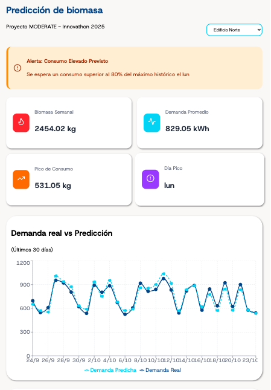
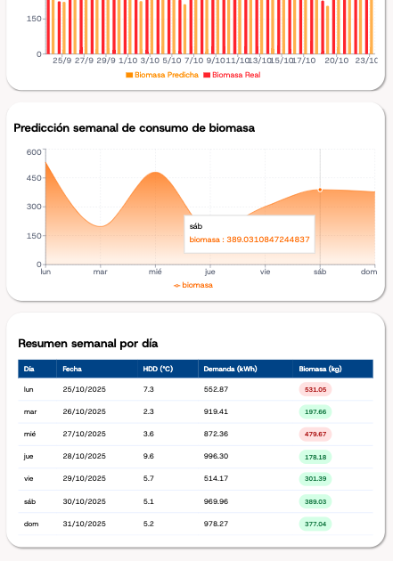

# Predicción de biomasa
## Proyecto MODERATE - Innovathon 2025

  
  

### 🎯 Contexto y objetivo
Abastecimiento de silos de biomasa en edificios residenciales.

El objetivo del proyecto es realizar una web/app que sea capaz de predecir la demanda de calefacción y consumo de biomasa para una semana en un conjunto reducido de instalaciones.  

### 🏆 Resultado final
Dashboard sencillo donde se aprecia un gráfico con las predicciones de los datos y el valor real. También presenta una tabla resumen con la información principal.

